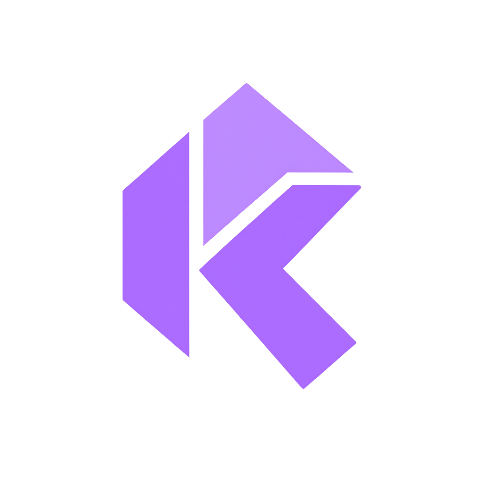

# Kosh — Solana Web Wallet

<p align="center">
  
</p>

> A secure, non-custodial Solana wallet built with Next.js 16. Manage your SOL, send and receive transactions, all from your browser.

---

## ✨ Features

-  **Non-custodial** — your keys never leave your device
-  **BIP39 mnemonic** — 12 or 24 word secret recovery phrase
-  **AES-256-GCM encryption** — vault encrypted with your password using Web Crypto API
-  **Multi-account** — derive multiple accounts from one mnemonic
-  **Send SOL** — with address validation and max balance
-  **Receive SOL** — QR code + one click copy address
-  **Devnet airdrop** — get free SOL for testing in one click
-  **Phantom-inspired UI** — dark purple aesthetic with smooth animations
-  **Web-first** — sidebar layout, works on any screen size

---

## 🛠️ Tech Stack

| Category | Library |
|---|---|
| Framework | Next.js 16 (App Router) |
| Language | TypeScript |
| Styling | Tailwind CSS v4 |
| Components | shadcn/ui (Nova preset) |
| Animation | Framer Motion |
| Blockchain | @solana/web3.js |
| Key Derivation | BIP39 + ed25519-hd-key |
| Encryption | Web Crypto API (PBKDF2 + AES-GCM) |
| State | Zustand |
| Forms | React Hook Form + Zod |
| Notifications | Sonner |
| QR Code | qrcode.react |

---

## 🚀 Getting Started

### Prerequisites

- Node.js 18+
- npm or yarn

### Installation

```bash
# clone the repo
git clone https://github.com/yourusername/kosh.git
cd kosh

# install dependencies
npm install

# copy env file
cp .env.example .env.local

# start dev server
npm run dev
```

Open [http://localhost:3000](http://localhost:3000) in your browser.

---

## ⚙️ Environment Variables

```bash
# .env.local

# Devnet (development)
NEXT_PUBLIC_SOLANA_RPC_URL=https://api.devnet.solana.com

# Mainnet (production) — get API key from https://helius.dev
# NEXT_PUBLIC_SOLANA_RPC_URL=https://mainnet.helius-rpc.com/?api-key=YOUR_KEY
```

---

## 📁 Project Structure

```
src/
├── app/
│   ├── (auth)/
│   │   ├── create/page.tsx       # create wallet — 3 step flow
│   │   └── import/page.tsx       # import existing wallet
│   ├── (wallet)/
│   │   ├── layout.tsx            # wallet layout + WalletGuard
│   │   ├── dashboard/page.tsx    # balance + actions
│   │   ├── send/page.tsx         # send SOL
│   │   ├── receive/page.tsx      # QR code + address
│   │   └── settings/page.tsx     # accounts + security + reset
│   ├── layout.tsx
│   ├── globals.css               # wallet theme tokens
│   └── page.tsx                  # landing / unlock screen
│
├── components/
│   ├── ui/
│   │   ├── PasswordInput.tsx     # show/hide password input
│   │   ├── Spinner.tsx           # loading states
│   │   └── CopyButton.tsx        # copy to clipboard
│   ├── MnemonicGrid.tsx          # 12/24 word phrase grid
│   ├── Sidebar.tsx               # shared navigation sidebar
│   └── WalletGuard.tsx           # protects wallet routes
│
├── hooks/
│   ├── useWallet.ts              # wallet state + actions
│   └── useBalance.ts             # SOL balance with polling
│
├── lib/
│   ├── animations.ts             # framer motion variants
│   ├── crypto.ts                 # AES-GCM encrypt/decrypt
│   ├── solana.ts                 # RPC connection + transactions
│   └── storage.ts                # localStorage vault management
│
├── store/
│   └── walletStore.ts            # zustand store
│
├── types/
│   └── wallet.ts                 # TypeScript types
│
└── utils/
    └── wallet.ts                 # BIP39 + keypair derivation
```

---

## 🔐 Security Model

```
mnemonic
    ↓
PBKDF2 (210,000 iterations) + random salt
    ↓
AES-256-GCM encryption with user password
    ↓
EncryptedVault → localStorage

Session (in memory only)
    ↓
decrypted on unlock → lives in Zustand store
    ↓
cleared on lock / tab close
```

- Secret key **never** touches localStorage
- Mnemonic stored only as AES-256-GCM ciphertext
- Wrong password → AES-GCM authentication tag fails automatically
- Session cleared from memory on lock

---

## 🌐 Wallet Flow

```
First time                    Returning user
──────────────                ──────────────
/create or /import            / (landing)
       ↓                             ↓
  set password                enter password
       ↓                             ↓
  vault → localStorage         decrypt vault
       ↓                             ↓
  session → memory             session → memory
       ↓                             ↓
   /dashboard                   /dashboard
```

---

## 🧪 Testing on Devnet

1. Create or import a wallet
2. Copy your public address from the sidebar
3. Click **Airdrop SOL** on the dashboard or visit [faucet.solana.com](https://faucet.solana.com)
4. Paste your address → select Devnet → get 2 SOL
5. Click **Refresh** to see updated balance

---

## 📜 Scripts

```bash
npm run dev      # start development server
npm run build    # build for production
npm run start    # start production server
npm run lint     # run eslint
```

---

## 🗺️ Roadmap

- [ ] Live SOL price from CoinGecko
- [ ] Transaction history
- [ ] Mainnet / Devnet toggle in settings
- [ ] SPL token support
- [ ] Hardware wallet support (Ledger)
- [ ] Mobile responsive layout

---

## ⚠️ Disclaimer

Kosh is built for educational purposes. Always verify transactions before signing. Never share your secret recovery phrase with anyone. Use at your own risk on mainnet.

---

## 📄 License

MIT © 2025 Kosh